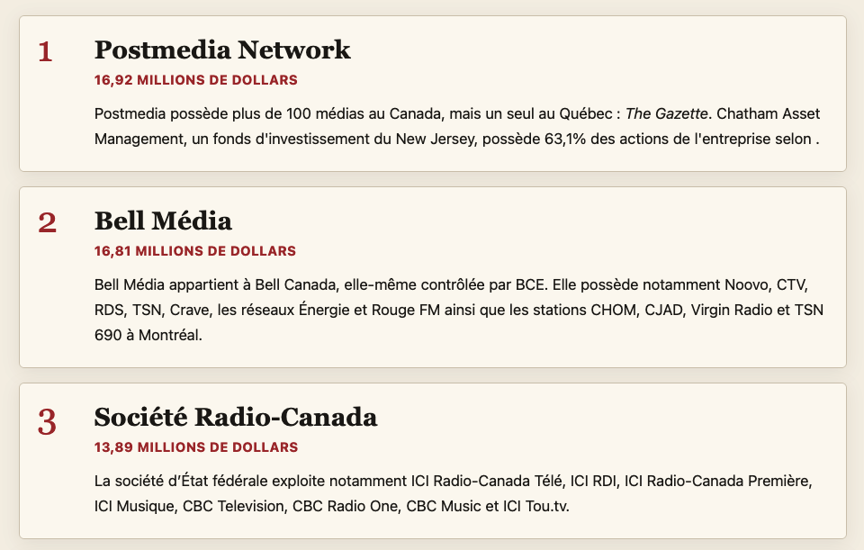

# Trois manières d'explorer la propriété des médias au Québec

Ce répertoire contient le code et les données à la base d'**infographies interactives** permettant d'explorer la propriété des médias au Québec&nbsp;:

## Par grappes de propriété

**[https://jhroy.github.io/propriete-medias-quebec/](https://jhroy.github.io/propriete-medias-quebec/)**

## Sur une carte

**[https://jhroy.github.io/propriete-medias-quebec/carte/](https://jhroy.github.io/propriete-medias-quebec/carte/)**

## Sur une liste

**[https://jhroy.github.io/propriete-medias-quebec/medias-quebec.html](https://jhroy.github.io/propriete-medias-quebec/medias-quebec.html)**

### Crédits techniques

- Données : colligées, compilées et vérifiées par Jean-Hugues Roy (avec l'utilisation de Claude, parfois, pour en vérifier la cohérence)
- Sources :
  - [Organigrammes de propriété du CRTC](https://crtc.gc.ca/ownership/fra/title_org.htm),
  - [Données ouvertes du Registre des entreprises (version du 1er avril 2026)](https://www.donneesquebec.ca/recherche/dataset/registre-des-entreprises),
  - Données sur les bénéficiaires du Collectif canadien de journalisme ([année 1 [2025]](https://cjc-ccj.ca/beneficiaires/beneficiaires-de-fonds-annee-1/), [année 2 [2026]](https://cjc-ccj.ca/beneficiaires/)),
  - [Carte des médias d'information du Québec du Centre d'études sur les médias](https://cem-admin.maps.arcgis.com/apps/dashboards/fdcbd1510de9413abba6eb783974bf08#).
- Géocodage via le script [**geo.py**](geo.py) mobilisant le [Référentiel québécois des adresses](https://www.donneesquebec.ca/recherche/dataset/referentiel-quebecois-des-adresses) du ministère des Ressources naturelles.
- Génération du code : Claude Code, mobilisant notamment [D3.js](https://d3js.org); ChatGPT pour le code HTML de la version liste.

Travail réalisé pour le magazine [*Le Trente*](https://www.fpjq.org/fr/les-editions) de la **Fédération professionnelle des journalistes du Québec (FPJQ)**

Version finale avant publication - 12 septembre 2026

###### *Signalez toute erreur à l'[auteur](mailto:roy.jean-hugues@uqam.ca)*
